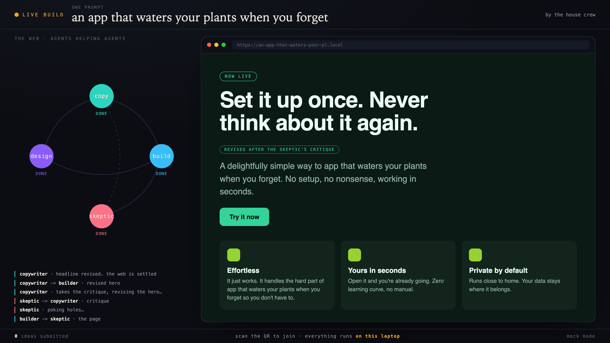
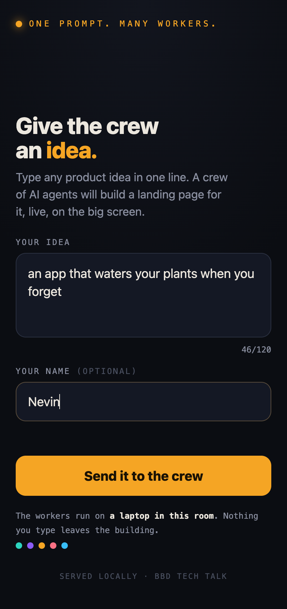
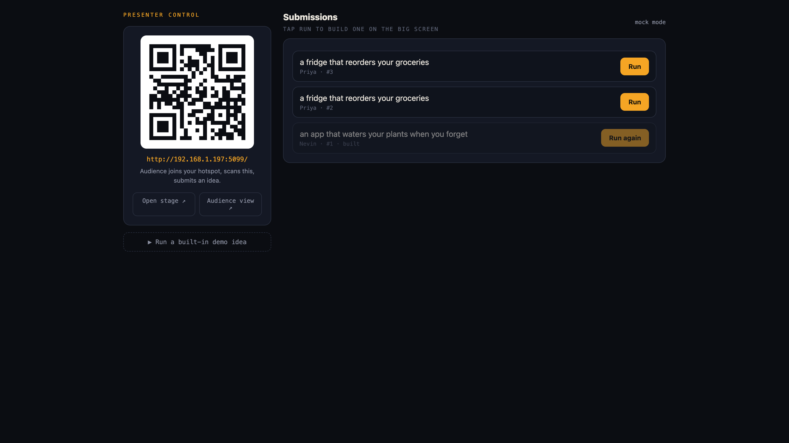
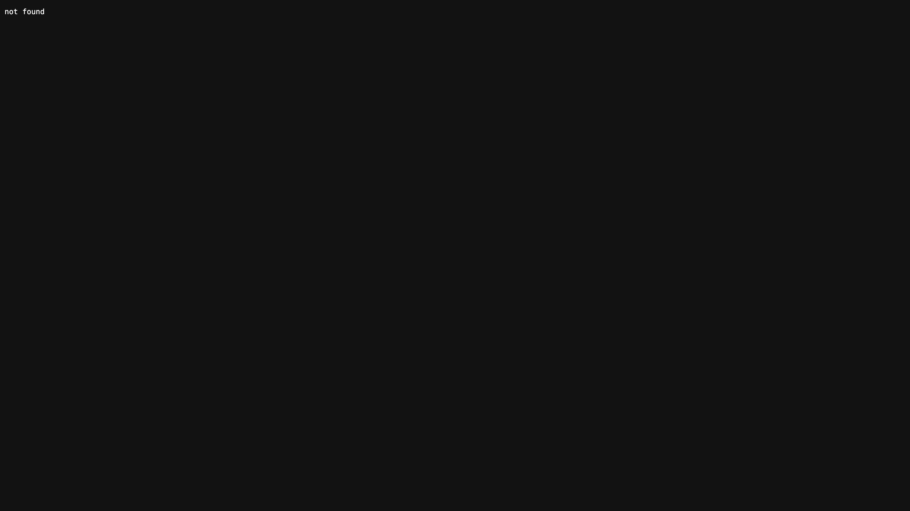
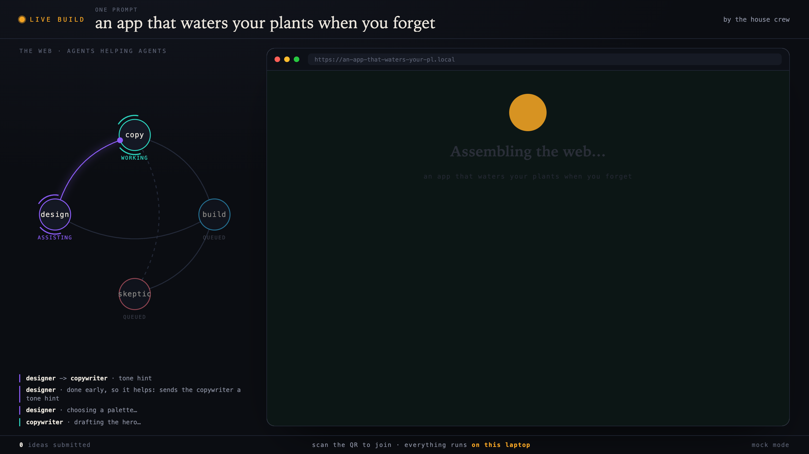
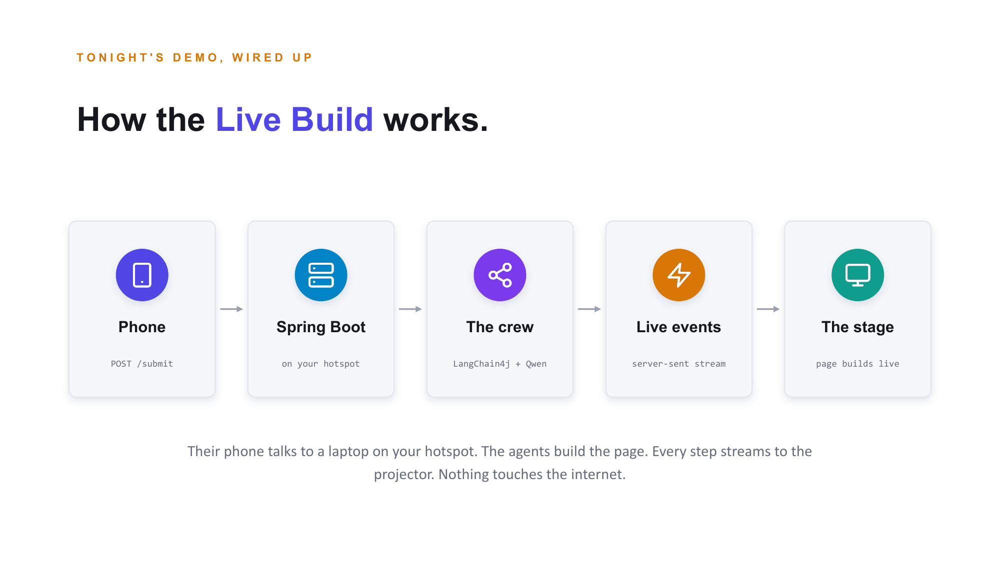
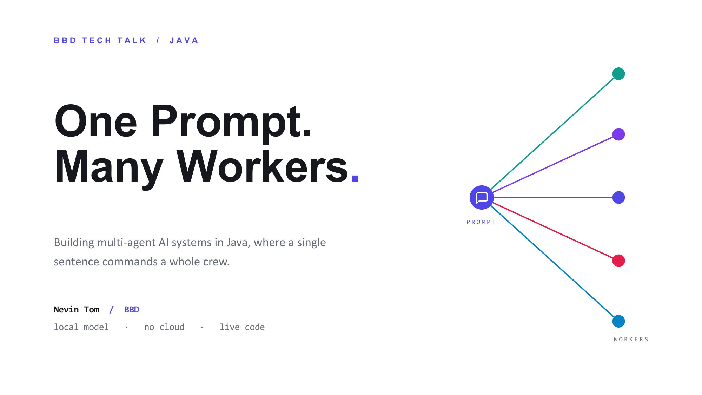
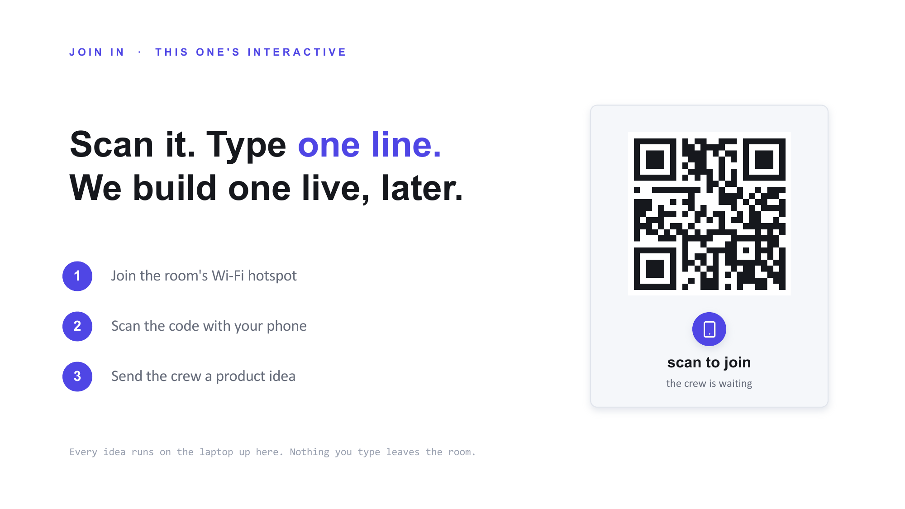
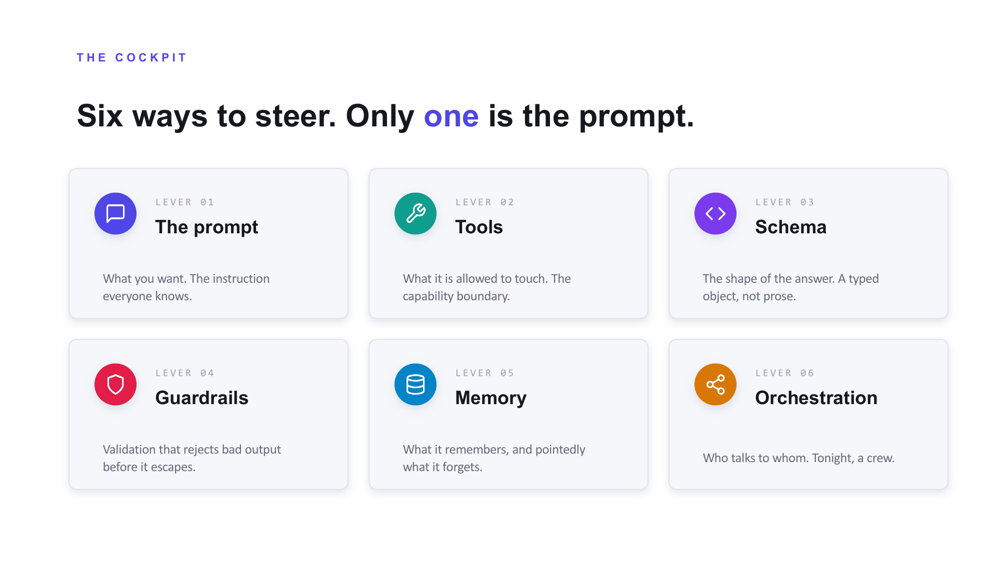
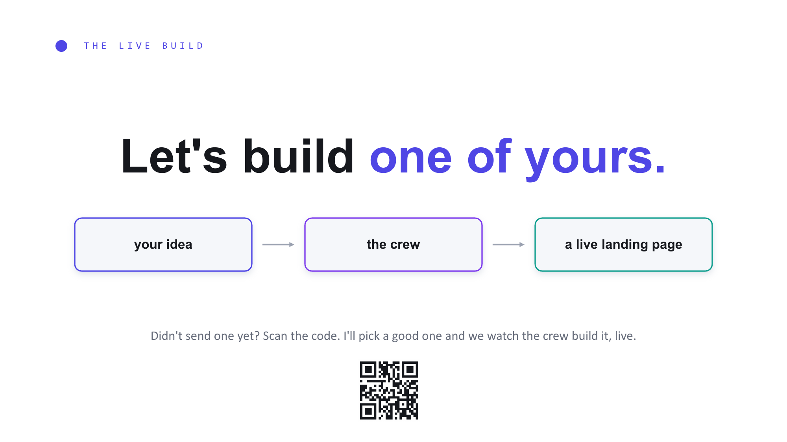

<div align="center">

# One Prompt. Many Workers.

### Building multi-agent AI systems in Java, where a single sentence commands a whole crew.


A complete kit for a BBD tech talk: a designed deck, a rehearsal script, a runnable
CLI demo, and an **interactive live-build web app** where the audience submits ideas
from their phones and a crew of local agents builds a real landing page on the
projector. Every token runs on a laptop through Ollama. Nothing leaves the room.



</div>

---

## What's inside

| Folder | What it is |
|---|---|
| [`live-build/`](live-build/) | **The interactive demo.** Spring Boot + LangChain4j + Ollama. Audience submits an idea, a crew builds a landing page live on stage. |
| [`deck/`](deck/) | A self-contained **HTML slide deck** (open in any browser, present offline). |
| [`slides/`](slides/) | The same talk as **PowerPoint** (`.pptx`), plus the generator that builds it. |
| [`talk/`](talk/SPEECH.md) | The **speaker script**, timed and annotated, slide by slide. |
| [`demo-cli/`](demo-cli/) | A minimal **orchestrator-worker CLI demo** (one prompt, a crew, one plan). |
| [`assets/`](assets/) | Screenshots used in this README. |

---

## The Live Build

The star of the talk. It performs the title live: one prompt (an audience member's
idea) becomes many workers (Copywriter, Designer, Builder, Skeptic) that build a
real landing page on stage. And the crew is a **spider net**, not a pipeline:
agents run in parallel, the one that finishes first assists another, and the
Skeptic's critique loops back so the Copywriter revises the headline live on the
projector.

<table>
  <tr>
    <td width="50%"><br><sub><b>Audience (phone)</b> scans a QR and sends one line.</sub></td>
    <td width="50%"><br><sub><b>Control (you)</b> see the queue and hit Run.</sub></td>
  </tr>
  <tr>
    <td><br><sub><b>Join</b> a full-screen QR for the projector.</sub></td>
    <td><br><sub><b>Stage</b> the web mid-run: edges pulse as agents help each other.</sub></td>
  </tr>
</table>

### How it works



A phone POSTs one line to a Spring Boot server on your hotspot. LangChain4j runs the
crew on a local Qwen model. Each step (an agent starting, a headline, a palette)
streams to the projector over Server-Sent Events, and the browser assembles the page
from that typed data. No internet anywhere in the path.

### Run it

```bash
cd live-build

# rehearse with canned outputs, no model needed (also your on-stage safety net)
mvn spring-boot:run -Dspring-boot.run.arguments=--live.mock=true

# the real thing, with local Qwen
ollama pull qwen2.5:3b
mvn spring-boot:run
```

Then open **`/stage`** on the projector, **`/control`** on your laptop, and show
**`/join`** for the QR. No Java handy? Preview the whole experience in Node:

```bash
cd live-build/mock && PORT=5099 node server.js
```

Full setup, hotspot notes, limits, and the fallback plan live in
[live-build/README.md](live-build/README.md). To test the whole talk end to end
before the day, follow [REHEARSAL.md](REHEARSAL.md).

---

## The deck

Twenty-seven slides that climb from a single prompt to a live swarm. Open
[`deck/index.html`](deck/index.html) in any browser and press **F** for fullscreen,
**N** for presenter notes. The same talk is in [`slides/`](slides/) as PowerPoint.

<table>
  <tr>
    <td width="50%"></td>
    <td width="50%"></td>
  </tr>
  <tr>
    <td></td>
    <td></td>
  </tr>
</table>

There are two PowerPoint builds in [`slides/`](slides/): a **light** edition (the
current one) and a **dark** edition. Both are generated from code in
[`slides/generator/`](slides/generator) with `pptxgenjs`, so the whole deck is
reproducible:

```bash
cd slides/generator && node build-light.js
```

---

## The CLI demo

The simplest version of the pattern, for the code walkthrough: one prompt, a planner
invents a crew, each worker runs, a synthesizer merges. Every agent is the same local
model wearing a different hat.

```bash
cd demo-cli
ollama pull qwen2.5:3b
mvn -q compile exec:java
mvn -q compile exec:java -Dexec.args="Plan the launch of our new developer API"
```

More in [demo-cli/README.md](demo-cli/README.md).

---

## The idea, in one breath

```
        one prompt (an English sentence)
              |
          [ Planner ]  -- structured output -->  a typed crew
              |                                    |     |     |
              |                               [Worker][Worker][Worker]   (same model, different hats)
              |                                    \    |    /
          [ Synthesizer / Builder ] <----------- their outputs
              |
        one thing, built and shown
```

The talk's argument: you do not *program* an agent, you **constrain** it. The prompt
says what, tools say how far, the schema says what shape, orchestration says who.
Good agent design is good constraint design.

---

## Tech stack

- **Java 17**, **Spring Boot 3.3** (web + Server-Sent Events)
- **[LangChain4j](https://docs.langchain4j.dev/) 1.x** for AI Services, tools, and structured output
- **[Ollama](https://ollama.com/)** running **Qwen 2.5** locally (no cloud, no API key)
- **ZXing** for the on-the-fly join QR
- Vanilla HTML/CSS/JS front ends (no build step)
- Decks generated with **pptxgenjs**; HTML deck is a single self-contained file

---

## Repository layout

```
.
├── live-build/            interactive Spring Boot demo (the star)
│   ├── src/main/java/com/bbd/live/   server, crew, agents, QR
│   ├── src/main/resources/static/    audience / stage / control / join
│   └── mock/              Node mirror for a no-Java preview
├── deck/                  self-contained HTML slide deck
├── slides/                PowerPoint decks + the generator
│   └── generator/         pptxgenjs source for both editions
├── talk/                  the speaker script
├── demo-cli/              minimal orchestrator-worker CLI demo
└── assets/                screenshots
```

---

## Prerequisites

| Tool | For | Notes |
|---|---|---|
| JDK 17+ and Maven | `live-build/`, `demo-cli/` | any recent JDK |
| [Ollama](https://ollama.com) + `qwen2.5:3b` | the live agents | optional: both Java demos have a mock/fallback mode |
| Node 18+ | the `live-build/mock` preview and the deck generator | optional |

---

## License

[MIT](LICENSE) © 2026 Nevin Tom

Built for a BBD tech talk. If you give this talk, tell me how it went.
